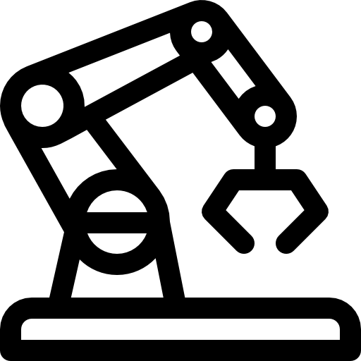
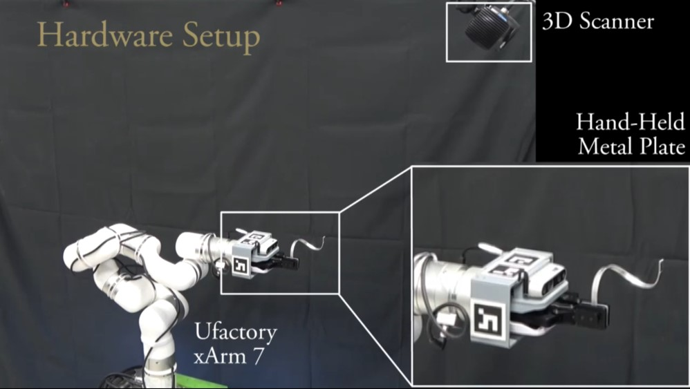
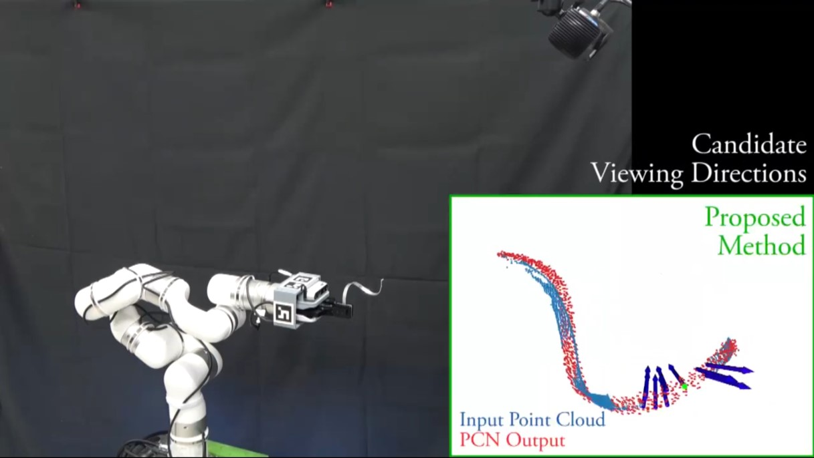
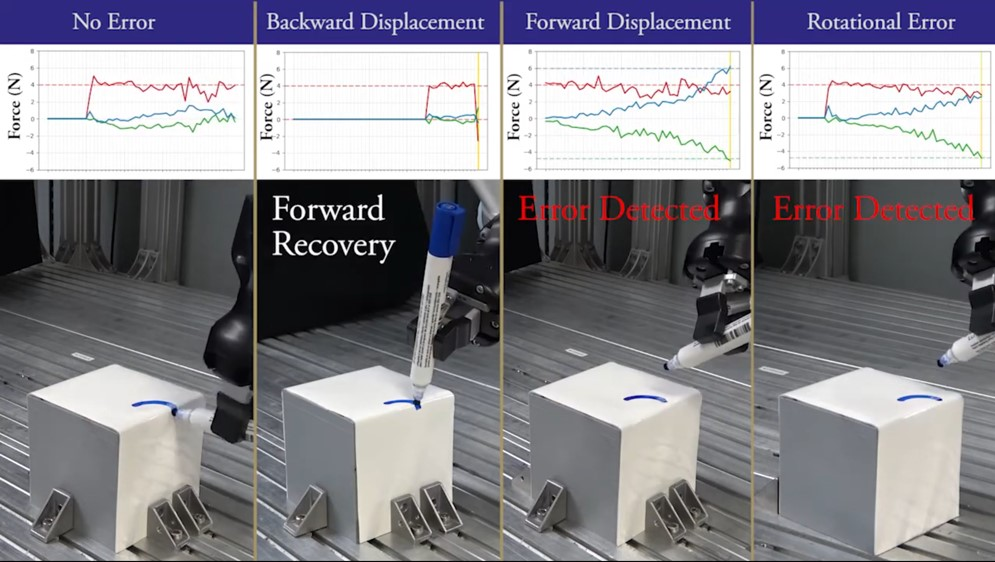

  

## Short Bio

I’m a Ph.D. candidate at [Harada Lab.](https://www.roboticmanipulation.org/), in [Osaka Unversity](https://www.osaka-u.ac.jp/ja), supervised by Professor [Harada Kensuke](http://www.hlab.sys.es.osaka-u.ac.jp/people/harada/) and Professor [Wan Weiwei](https://wanweiwei07.github.io/). My research interest is robotic manipulation. I received my M.E. from Nanyang Technologic University and B.E. from Tianjin University, China.

## Research Interest
My major interest is robotic manipulation, which include grasping planning, motion planning, and other low level and high level task planning algorithms. I am also studying visual perception, image processing and force control to enhance the robotic manipulation system. 

## Research

    

        <h3>Next Best View Planning for Metal Plate 3D Model Obtaining</h3>
         Ruishuang Liu, Chuan Li, Weiwei Wan, Jia Pan, and Kensuke Harada   
        [<a href="" title="jornal">Paper</a>](coming soon.) 
        
        
    

    

        
 This video shows a Next Best Views (NBV) planner for capturing a thin, curved metal plate using a depth camera and a robot manipulator equipped with an external stationary depth sensor. The proposed approach aims to efficiently collect the object's surface point cloud data and reconstruct its 3D model with a minimal number of views. 

    

    

        <h3>Metal Wire Manipulation Planning for 3D Curving</h3>
         Ruishuang Liu, Weiwei Wan, Emiko Tanaka Isomura, and Kensuke Harada   
         IEEE/RSJ International Conference on Intelligent Robots and Systems (IROS), 2022.   
        [<a href="https://ieeexplore.ieee.org/stamp/stamp.jsp?tp=&arnumber=9981672" title="conf">Conference</a>]
        [<a href="https://scholar.googleusercontent.com/scholar.bib?q=info:WaDBswOre7UJ:scholar.google.com/&output=citation&scisdr=Cm3DAmuTEMn7l9IeYxk:AGlGAw8AAAAAZFoYexkwR4-CKje9pdaUg310m0M&scisig=AGlGAw8AAAAAZFoYe19vwWigESv1SCFN-lLugE4&scisf=4&ct=citation&cd=-1&hl=zh-CN">Bibtex</a>]
        [<a href="" title="jornal">Jornal</a>](coming soon.)  
        
        
    

    

        
This video shows a combined task and motion planner (TAMP) for a robot arm to work with a bending machine in 3D metal wire curving tasks commonly found in manufacturing and medical fields. Our method converts a 3D curve to a bending set and generates the feasible bending sequence, machine usage, robotic grasp poses, and pick-and-place arm motion considering the combined task and motion level constraints. 

    

    

        <h3>Robotic 3D Drawing</h3>
         Ruishuang Liu, Weiwei Wan, Keisuke Koyama, and Kensuke Harada   
         IEEE Transactions on Robotics (TRO), 2021.   
        [<a href="https://rsliu-xx.github.io/_pages/rbtdraw.html" title="page">Website</a>]
        [<a href="https://ieeexplore.ieee.org/stamp/stamp.jsp?tp=&arnumber=9570721" title="Paper">Paper</a>]
        [<a href="https://scholar.googleusercontent.com/scholar.bib?q=info:f2cdT9OI1EcJ:scholar.google.com/&output=citation&scisdr=CgX_ZLo4EJyfhxtNV3I:AAGBfm0AAAAAYpJLT3I0st75nDFSK5-mRtzkMTVwCNKh&scisig=AAGBfm0AAAAAYpJLTwziRwqnitpiT3PM7-CeEVv1qqPe&scisf=4&ct=citation&cd=-1&hl=en">Bibtex</a>]  
        
        
    

    

        
This video shows a flexible and robust robotic system for autonomous drawing on 3D surfaces. The system maps the strokes onto the surface and generates robot motion using visual recognition, grasp pose reasoning, and motion planning. Unlike conventional systems, the robot can recognize and pick up pens to draw 3D strokes, making it more flexible. The system's robustness is ensured by minimizing deformation in the strokes, re-estimating the drawing tool's pose, employing force control, and implementing error detection and recovery. 

    

